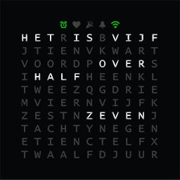

# WordClock

Hobby project building a word clock with friends. Features are still being debated, design is still being tweaked, software is still being improved, hardware is still being changed. This is very much a work in progress.

# Table of Contents
* [The idea](#the-idea)
* [Parts](#required-parts-and-components)
  - [Optional but very much recommmended parts and components](#optional-but-very-much-recommended-parts-and-components)
  - [Optional parts and components](#optional-parts-and-components)
* [Build instructions](#build-instructions)
* [Getting started with the software](#getting-started-with-the-software)
* [FAQ](#faq)

## The idea

The idea is to take a 230mm x 230mm Ribba ([Black](https://www.ikea.com/nl/nl/p/ribba-fotolijst-zwart-40378401/) or [white](https://www.ikea.com/nl/nl/p/ribba-fotolijst-wit-00378403/), Shamone!) and repurpose it as a WordClock. We'll use a cutting plotter on self adhesive vinyl to cut the words and icons. The design is a bit different from most other WordClocks in that it includes a few icons which can be assigned for any purpose. The design includes:

- An alarmclock - as an indicator an alarm is set for example
- A heart - as a seconds-indicator (make it 'pulse' red to give it a heartbeat feel) or maybe you make it light up on Valentine's day?
- A party popper - have it light up at all the birthdays in your family or on New Year's eve or...
- A bell - to indicate you have new e-mail or to remind of you something (make it flash!) or...
- A WiFi symbol - we can make it light up blue for connecting, red for errors or problems, green for 'everything OK' and maybe yellow for NTP syncing. Or anything else we want...

Because we use RGB leds any of the indicators can have multiple functions, as do the letters by the way, by combining color, flashing or 'pulsing' and other effects. Because we have 115 "pixels" available that we can make pretty much any color we can do a whole lot with this "display" other than have it display the time. Think of rainbow or 'matrix' effects, playing snake, or tetris, on it with your phone as a controller, displaying an analogue clock using the "pixels", have it display the roomtemperature or even the local weather... We're only limited by the restrictions of the microcontroller, what is possible in software and what we can display on the 'screen'. And that sounds restrictive but having WiFi and, thus, internect connectivity we can do a LOT and are mostly bound by our own imagination.

## Required parts and components

- A Ribba (see [the idea](#the-idea))
- A [Wemos D1 mini](https://www.aliexpress.com/item/32651747570.html) (or a NodeMCU, ESP32, Raspberry pi)
- At least 2 meters (115 LEDs minimum) of [60 LED/m WS2812B LED strip](https://www.aliexpress.com/item/2036819167.html) (IP30 will do)
- A [5V DC power supply](https://www.aliexpress.com/item/4000364274787.html) capable of delivering _at least_ 7A or more; I can recommend the LRS-50-5
- A [Power supply cable](https://www.aliexpress.com/item/4000390134327.html)
- [A 220Ω-470Ω resistor](https://www.aliexpress.com/item/32847047012.html) to prevent echo/noise on the LED strip data line and to current-limit the signal pin

According to the specs, a WS2812B draws 18W per meter at 60 LEDs per meter. That's 18W / 60LEDs = 0.3W per LED. That's 0.3W / 5V = 0.06A per LED. Given 115 LED's (10 rows of 11 LEDs + 5 status LEDs) we'll need at least 6.9A + some for the microcontroller and optional other parts.

It's generally recommended to 'inject power' every 2.5 feet or every 75 cm so we won't have 'yellowing' at the end of the LED strip and also won't be overloading our wiring.

Since, normally, we won't be driving all LEDs at the same time at full brightness we do have some headroom in both the specs of the power supply and the power injection. You'll probably get along just fine with a 3A power supply and injecting power only at the beginning of the strip; however we like to err on the safe side, especially since we don't know what other uses we can think of for our clock in the future which might require lighting more, or even all, LEDs or driving additional circuitry as well.

In normal operation about 20~25 LEDs will be on at the same time, which should draw about 1.5A max. Only in the very worst case scenario will we need the full 7A. However, we _designed_ this clock to be able to handle this (should we add functionality other than displaying the time, requiring more/all LEDs to be lit). Because of this it is also important to use at least 0.82mm² / 18 AWG wire at minimum to provide power to the LED strip. A short strip of the power cable could be used for that purpose.

### Optional, but very much recommended parts and components

You _can_ just solder wires directly to components or other wires, you don't _need_ connectors, you don't _need_ to heatshrink connections and you don't _need_ a PCB technically. These parts and components do, however, improve the quality of the product by a big margin. I strongly suggest you get these as well. We will use these in our build instructions.

- [D1 Protoboard shield](https://www.aliexpress.com/item/32790791836.html) to put all components on
- [5 Spade terminal connectors](https://www.aliexpress.com/item/32985520928.html) to hook up the powersupply (better than clamping the wire, but still optional) *
- [A short length of 0.82mm² / 18 AWG wire](https://www.aliexpress.com/item/4000037800462.html) to provide power to the LED strip, 50 cm should be more than sufficient
- [Heatshrink](https://www.aliexpress.com/item/32788409697.html) to properly isolate your wire solderjoints
- [5 pairs of 3pin SM JST connector male/female for WS2812B LED Strip](https://www.aliexpress.com/item/1718558728.html)
- [An LDR](https://www.aliexpress.com/item/32760631393.html) with [a 10KΩ resistor](https://www.aliexpress.com/item/32847047012.html) or, alternatively, a [light sensor](https://www.aliexpress.com/item/32550638947.html) to have the clock auto-adjust brightness

\* Make sure you order the correct size for the terminal screws on your powersupply. For M3.5 screws order SV 1.25-3.5 if you can, else round up to SV 1.25-4

### Optional parts and components

To improve the circuit or to add additional features:

- Although I haven't experienced any problems, a logic level shifter ([74HCT245](https://www.aliexpress.com/item/32859131651.html)) [_may_](https://happyinmotion.com/?p=1247) be [required](https://forums.adafruit.com/viewtopic.php?f=47&t=47420&sid=6f6ece936d65e8158713022c7ed27734#p238463) to shift the 3.3V signal to the LED strip to 5V
- [A breadboard](https://www.aliexpress.com/item/32256273855.html) to help out during the build
- [Projectbox](https://www.aliexpress.com/item/32889586884.html) to put the microcontroller and other components in
- [Some 1000μF electrolytic capacitors](https://www.aliexpress.com/item/32909080992.html) with a voltage rating at least 5V if your LED strip doesn't have built-in capacitors **
- [DHT22](https://www.aliexpress.com/item/32802908424.html) to give your clock another purpose: temperature / humidity sensor
- [Power switch](https://www.aliexpress.com/item/32832214619.html) or [inline power switch](https://www.aliexpress.com/item/32907410798.html); not required (you can simply unplug)
- [A buzzer](https://www.aliexpress.com/item/32849730395.html) to give your clock an alarm function

** If your LEDstrip has no 'smoothing' capacitors 'built-in', you should consider putting one of them at every point where the power is injected into the strip. The 470Ω resistor is used for current limiting the data pin. If you opt for an LDR you'll need the 10KΩ resistor for a voltage divider.

## Build instructions

See [our Wiki page](https://github.com/RobThree/WordClock/wiki/Build-instructions) for build instructions.

## Getting started with the software

Built with VS Code and [PlatformIO](https://platformio.org/); download and instructions [here](https://platformio.org/install/ide?install=vscode).

**Below procedure is only a temporary thing, we will provide a much better procedure and experience in the future**

To get started you'll initially need to flash the Wemos over USB ("serial") first providing the SSID and password for your WiFi network. Start with copying `example_env_secrets.ini` to `env_secrets.ini`; this contains your OTA-password (which, by default, is "`my_ota_secret`"). Next copy `include\example_config.h` to `include\config.h`. At the very least change `WIFI_SSID` and `WIFI_PASSWD`. Also make sure you enter a known, good, NTP host; if `pool.ntp.org` doesn't work for you (I personally experience some unexplained problems at times), you can try `time.google.com`, `time.windows.com`, `time.cloudflare.com`, `time.apple.com` or any other NTP server (maybe even your ISP's time server or maybe even LAN time server like your NAS etc. which may provide an NTP service).

The `OTA_HOSTNAME` is your clock's name and `OTA_PASSWORD` is, you guessed it, your clock's OTA password. Make sure the password matches the password in `env_secrets.ini`. Your clock will be reachable as `wordclock.local` (see [mDNS](https://en.wikipedia.org/wiki/.local#mDNS_implementations)).

Next, open `platformio.ini`, and make sure the `default_envs` is set to `d1_mini_serial` (NOT `d1_mini_ota`). Set the `upload_port` value to your clock's name (`<clockname>.local`). Now connect your Wemos to USB. Finally, click the 'Upload' button in the toolbar in the very bottom of VSCode (the arrow pointing to the right, next to the checkmark). The project should compile and then be flashed to the μC. Wait for it to complete. And wait for it to reboot. Keep it connected; you should be able to see the clock booting and connecting to WiFi by watching the serial monitor (the 'plug' button, in the same bottom toolbar of VSCode). If you're too late, just press the reset button on the side of the Wemos. Make sure the Wemos connects to WiFi (the WiFi symbol should turn green and you should be able to see confirmation in the serial monitor). You should see 'Station connected, IP: x.x.x.x'. Note the IP.

If the clock connects to WiFi correctly, you can unplug the USB lead and plug the clock into mains. From now on, you can update 'OTA'. Confirm you can ping your clock over WiFi (`ping <clockname>.local` or `ping x.x.x.x` where `x.x.x.x` is the IP you noted earlier). If you get a ping reply (make sure it's stable, not intermittently losing packets) you're ready to flash 'OTA'. Don't worry; when an OTA update fails, the clock will keep running the previous version; should you 'brick' the clock you should always be able to (re)flash using the USB method.

To flash OTA you need to open `platform.io` again and change `default_envs` back from `d1_mini_serial` to `d1_mini_ota`. Verify again the `upload_port` is set to `<clockname>.local` or, if that doesn't work, your clock's IP. You can now click the upload button in the bottom toolbar (the arrow pointing right) and the update should be sent 'OTA'. From now on, you can make changes just by clicking the upload button every time you made a change.

## FAQ

* **This thing burnt my house down! Who do I sue?** 
So sorry 'bout that. I hope you and your family are OK. **However**, this project is entirely at your own risk. Use your own judgement. I am **not** an electrical engineer; I'm a hobbyist at best. Also **always** make sure you unplug before working on the electrical components of the clock and use proper precautions. All I can say is that mine hasn't burst into flames (yet) and that I did my best to have enough tolerances in the design where appropriate. Also: make sure you buy a quality powersupply!
* **Do I have to order everything over at AliExpress?** 
Ofcourse not! It's just where I order most of my (cheap) parts. You can order equivalent parts anywhere you like!
